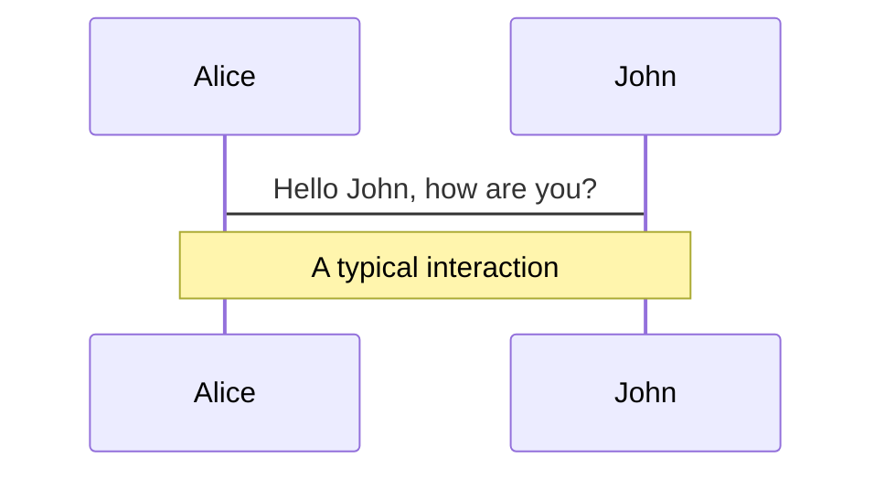
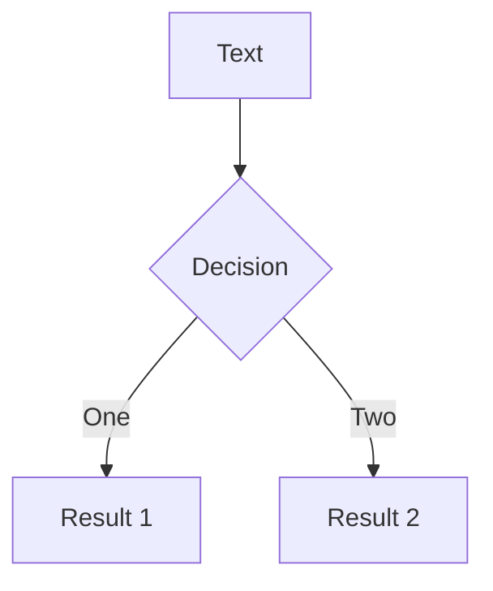
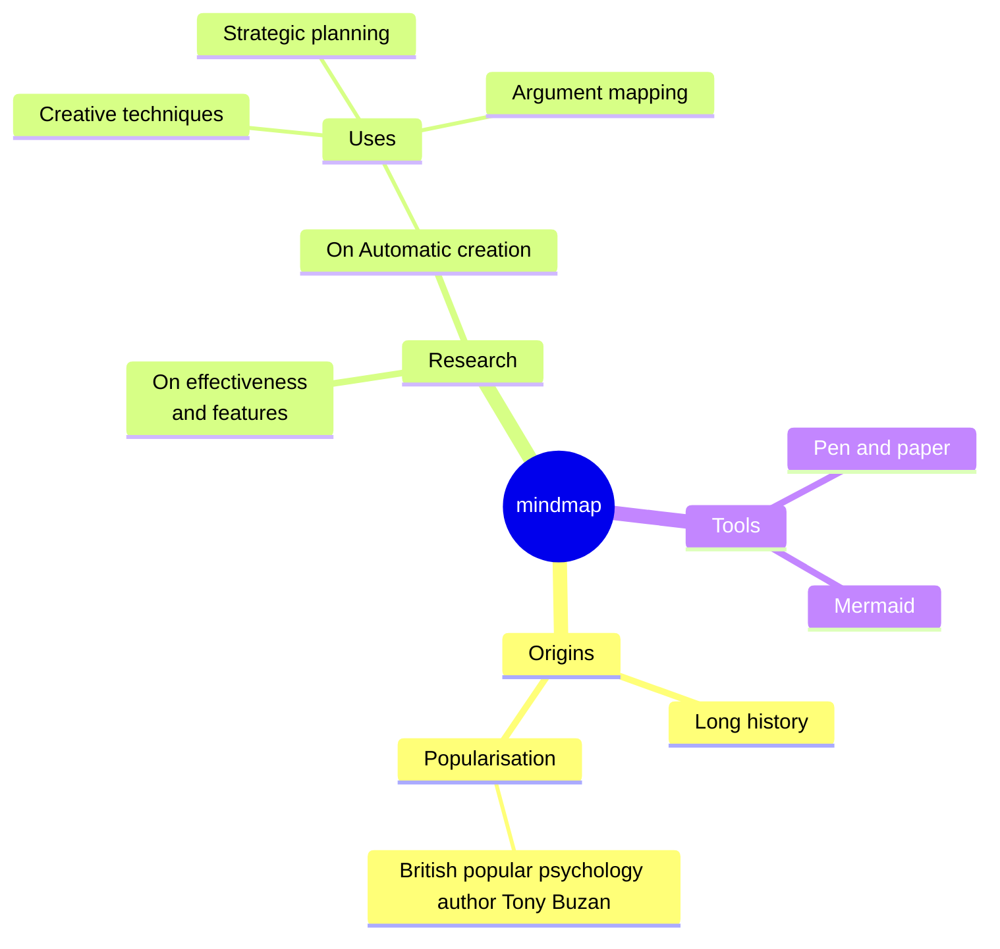
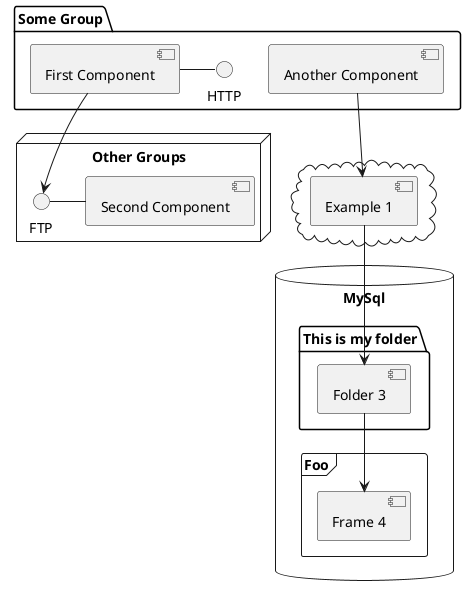

---
# try also 'default' to start simple
theme: seriph
# random image from a curated Unsplash collection by Anthony
# like them? see https://unsplash.com/collections/94734566/slidev
background: https://cover.sli.dev
# some information about your slides (markdown enabled)
title: Shanze
info: |
  ## Slidev Starter Template
  Presentation slides for developers.

  Learn more at [Sli.dev](https://sli.dev)
# apply UnoCSS classes to the current slide
class: text-center
# https://sli.dev/features/drawing
drawings:
  persist: false
# slide transition: https://sli.dev/guide/animations.html#slide-transitions
transition: slide-left
# enable MDC Syntax: https://sli.dev/features/mdc
mdc: true
# duration of the presentation
duration: 35min
# background: rgb(127,0,32)
fonts:
  sans: MiSans VF
  serif: Noto Serif CJK SC
  mono: Adwaita Mono
---

</img>

<div class="text-center">
  <p class="font-bold">
    山泽新能源科技有限公司
  </p>
  <p>
    基于电芯技术的多场景储能与移动能源解决方案提供商
  </p>

</div>

<div class="abs-br m-6 text-xl">
  <button @click="$slidev.nav.openInEditor()" title="Open in Editor" class="slidev-icon-btn">
    <carbon:edit />
  </button>
  <a href="https://www.linkedin.com/company/shanzetech/" target="_blank" class="slidev-icon-btn">
    <carbon:logo-linkedin />
  </a>
  <a href="https://www.youtube.com/@shanzesz" target="_blank" class="slidev-icon-btn">
    <carbon:logo-youtube />
  </a>
</div>

<!--
The last comment block of each slide will be treated as slide notes. It will be visible and editable in Presenter Mode along with the slide. [Read more in the docs](https://sli.dev/guide/syntax.html#notes)
-->

---
layout: two-cols
layoutClass: gap-16
---

# 目录

You can use the `Toc` component to generate a table of contents for your slides:

```html
<Toc minDepth="1" maxDepth="1" />
```

The title will be inferred from your slide content, or you can override it with `title` and `level` in your frontmatter.

::right::

<Toc text-sm minDepth="1" maxDepth="2" />

---
class: text-left px-14
---

# 公司概况

- **公司名称**：东莞山泽新能源科技有限公司
- **品牌/简称**：山泽能源
- **成立时间**：2022 年 4 月 18 日
- **注册资本**：1,000 万元人民币
- **企业性质**：有限责任公司（自然人投资或控股）
- **所在地**：广东省东莞市长安镇
- **所属行业**：新能源及电子制造（电池与储能相关应用）

公司简介：东莞山泽新能源科技有限公司专注于电池及新能源相关产品的研发、制造与销售，业务覆盖电池电芯、储能系统、启停电源以及移动电源等多类产品。公司立足东莞制造基地，依托成熟的电芯工艺与新材料技术，面向消费电子、家用及便携储能、汽车启停等多元应用场景，为客户提供稳定可靠的新能源解决方案。

<div class="text-sm text-gray-500 mt-6">
  参保人数：7 人（精干团队，灵活高效）<br>
  经营状态：开业（持续经营中）
</div>

---

# 发展历程与股东背景

## 发展历程

- 2022.04 东莞山泽新能源科技有限公司正式成立，聚焦电池制造与新兴能源技术研发
- 2022–2023 建立电池及电池零部件生产体系，逐步拓展至电子元器件与机电组件制造
- 2023–2024 形成以电芯为核心，向储能电源、启停电源、移动电源等成品延伸的业务布局
- 2024 起 加大在半固态电池、便携储能和磁吸移动电源等方向的研发投入，推动产品升级与业务转型

## 股东结构亮点

- 实控人及大股东：张烈先生，持股比例 75%，兼任执行董事、经理及财务负责人
- 战略股东：
  - 山东山泽新能源科技有限公司（持股 10%）
  - 赣州市沃能新能源有限公司（持股 10%）

**总结**：公司股东背景涵盖新能源电池及相关产业链企业，为山泽能源在技术、供应链及市场协同方面提供了坚实支撑。

---
class: px-14 py-10
---

# 业务布局与产品矩阵

## 一张图说明业务版块（四宫格）

<div class="grid grid-cols-2 gap-6 mt-6 text-slate-900">
  <div class="rounded-2xl bg-gradient-to-br from-[#e0ecff] to-white ring-1 ring-sky-200 shadow-md p-5">
    <div class="flex items-center justify-between">
      <p class="text-lg font-semibold">电池电芯业务</p>
      <span class="text-xs text-sky-800 bg-white/90 px-2 py-1 rounded-full border border-sky-200 shadow-sm">核心</span>
    </div>
    <ul class="list-disc pl-5 mt-3 space-y-2 text-sm leading-relaxed">
      <li>电池制造、电池零配件生产与销售</li>
      <li>面向多种容量与规格定制</li>
    </ul>
  </div>
  <div class="rounded-2xl bg-gradient-to-br from-[#e8edff] to-white ring-1 ring-indigo-200 shadow-md p-5">
    <div class="flex items-center justify-between">
      <p class="text-lg font-semibold">储能产品</p>
      <span class="text-xs text-indigo-800 bg-white/90 px-2 py-1 rounded-full border border-indigo-200 shadow-sm">储发一体</span>
    </div>
    <ul class="list-disc pl-5 mt-3 space-y-2 text-sm leading-relaxed">
      <li>便携储能、电源模组</li>
      <li>结合光伏设备与元器件，实现储发一体解决方案</li>
    </ul>
  </div>
  <div class="rounded-2xl bg-gradient-to-br from-[#ffeeda] to-white ring-1 ring-amber-200 shadow-md p-5">
    <div class="flex items-center justify-between">
      <p class="text-lg font-semibold">启停电源</p>
      <span class="text-xs text-amber-800 bg-white/90 px-2 py-1 rounded-full border border-amber-200 shadow-sm">高倍率</span>
    </div>
    <ul class="list-disc pl-5 mt-3 space-y-2 text-sm leading-relaxed">
      <li>面向汽车/设备启停场景的电源产品</li>
      <li>高倍率放电、可靠启停性能</li>
    </ul>
  </div>
  <div class="rounded-2xl bg-gradient-to-br from-[#e5f7ed] to-white ring-1 ring-emerald-200 shadow-md p-5">
    <div class="flex items-center justify-between">
      <p class="text-lg font-semibold">移动电源成品</p>
      <span class="text-xs text-emerald-800 bg-white/90 px-2 py-1 rounded-full border border-emerald-200 shadow-sm">消费终端</span>
    </div>
    <ul class="list-disc pl-5 mt-3 space-y-2 text-sm leading-relaxed">
      <li>半固态电池磁吸移动电源</li>
      <li>快充、安全、轻薄，服务消费电子终端</li>
    </ul>
  </div>
</div>

<div class="mt-8 text-sm leading-relaxed bg-gray-50 border border-gray-100 rounded-xl p-4">
  <strong>总结：</strong>山泽能源以电芯为核心，向储能、启停、移动电源等多产品形态延伸，能够根据客户场景需求，提供从零部件到整机的多层级产品与解决方案。
</div>

---
layout: image-right
image: https://cover.sli.dev
---

# Code

Use code snippets and get the highlighting directly, and even types hover!

```ts [filename-example.ts] {all|4|6|6-7|9|all} twoslash
// TwoSlash enables TypeScript hover information
// and errors in markdown code blocks
// More at https://shiki.style/packages/twoslash
import { computed, ref } from "vue";

const count = ref(0);
const doubled = computed(() => count.value * 2);

doubled.value = 2;
```

<arrow v-click="[4, 5]" x1="350" y1="310" x2="195" y2="342" color="#953" width="2" arrowSize="1" />

<!-- This allow you to embed external code blocks -->

<<< @/snippets/external.ts#snippet

<!-- Footer -->

[Learn more](https://sli.dev/features/line-highlighting)

<!-- Inline style -->
<style>
.footnotes-sep {
  @apply mt-5 opacity-10;
}
.footnotes {
  @apply text-sm opacity-75;
}
.footnote-backref {
  display: none;
}
</style>

<!--
Notes can also sync with clicks

[click] This will be highlighted after the first click

[click] Highlighted with `count = ref(0)`

[click:3] Last click (skip two clicks)
-->

---
level: 2
---

# Shiki Magic Move

Powered by [shiki-magic-move](https://shiki-magic-move.netlify.app/), Slidev supports animations across multiple code snippets.

Add multiple code blocks and wrap them with <code>````md magic-move</code> (four backticks) to enable the magic move. For example:

````md magic-move {lines: true}
```ts {*|2|*}
// step 1
const author = reactive({
  name: "John Doe",
  books: [
    "Vue 2 - Advanced Guide",
    "Vue 3 - Basic Guide",
    "Vue 4 - The Mystery",
  ],
});
```

```ts {*|1-2|3-4|3-4,8}
// step 2
export default {
  data() {
    return {
      author: {
        name: "John Doe",
        books: [
          "Vue 2 - Advanced Guide",
          "Vue 3 - Basic Guide",
          "Vue 4 - The Mystery",
        ],
      },
    };
  },
};
```

```ts
// step 3
export default {
  data: () => ({
    author: {
      name: "John Doe",
      books: [
        "Vue 2 - Advanced Guide",
        "Vue 3 - Basic Guide",
        "Vue 4 - The Mystery",
      ],
    },
  }),
};
```

Non-code blocks are ignored.

```vue
<!-- step 4 -->
<script setup>
const author = {
  name: "John Doe",
  books: [
    "Vue 2 - Advanced Guide",
    "Vue 3 - Basic Guide",
    "Vue 4 - The Mystery",
  ],
};
</script>
```
````

---

# Components

<div grid="~ cols-2 gap-4">
<div>

You can use Vue components directly inside your slides.

We have provided a few built-in components like `<Tweet/>` and `<Youtube/>` that you can use directly. And adding your custom components is also super easy.

```html
<Counter :count="10" />
```

<!-- ./components/Counter.vue -->
<Counter :count="10" m="t-4" />

Check out [the guides](https://sli.dev/builtin/components.html) for more.

</div>
<div>

```html
<Tweet id="1390115482657726468" />
```

<Tweet id="1390115482657726468" scale="0.65" />

</div>
</div>

<!--
Presenter note with **bold**, *italic*, and ~~striked~~ text.

Also, HTML elements are valid:
<div class="flex w-full">
  <span style="flex-grow: 1;">Left content</span>
  <span>Right content</span>
</div>
-->

---
class: px-20
---

# Themes

Slidev comes with powerful theming support. Themes can provide styles, layouts, components, or even configurations for tools. Switching between themes by just **one edit** in your frontmatter:

<div grid="~ cols-2 gap-2" m="t-2">

```yaml
---
theme: default
---
```

```yaml
---
theme: seriph
---
```


</div>

Read more about [How to use a theme](https://sli.dev/guide/theme-addon#use-theme) and
check out the [Awesome Themes Gallery](https://sli.dev/resources/theme-gallery).

---

# Clicks Animations

You can add `v-click` to elements to add a click animation.

<div v-click>

This shows up when you click the slide:

```html
<div v-click>This shows up when you click the slide.</div>
```

</div>

<br>

<v-click>

The <span v-mark.red="3"><code>v-mark</code> directive</span>
also allows you to add
<span v-mark.circle.orange="4">inline marks</span>
, powered by [Rough Notation](https://roughnotation.com/):

```html
<span v-mark.underline.orange>inline markers</span>
```

</v-click>

<div mt-20 v-click>

[Learn more](https://sli.dev/guide/animations#click-animation)

</div>

---

# Motions

Motion animations are powered by [@vueuse/motion](https://motion.vueuse.org/), triggered by `v-motion` directive.

```html
<div
  v-motion
  :initial="{ x: -80 }"
  :enter="{ x: 0 }"
  :click-3="{ x: 80 }"
  :leave="{ x: 1000 }"
>
  Slidev
</div>
```

<div class="w-60 relative">
  <div class="relative w-40 h-40">
    
    
    
  </div>

  <div
    class="text-5xl absolute top-14 left-40 text-[#2B90B6] -z-1"
    v-motion
    :initial="{ x: -80, opacity: 0}"
    :enter="{ x: 0, opacity: 1, transition: { delay: 2000, duration: 1000 } }">
    Slidev
  </div>
</div>

<!-- vue script setup scripts can be directly used in markdown, and will only affects current page -->
<script setup lang="ts">
const final = {
  x: 0,
  y: 0,
  rotate: 0,
  scale: 1,
  transition: {
    type: 'spring',
    damping: 10,
    stiffness: 20,
    mass: 2
  }
}
</script>

<div
  v-motion
  :initial="{ x:35, y: 30, opacity: 0}"
  :enter="{ y: 0, opacity: 1, transition: { delay: 3500 } }">

[Learn more](https://sli.dev/guide/animations.html#motion)

</div>

---

# LaTeX

LaTeX is supported out-of-box. Powered by [KaTeX](https://katex.org/).

<div h-3 />

Inline $\sqrt{3x-1}+(1+x)^2$

Block

$$
{1|3|all}
\begin{aligned}
\nabla \cdot \vec{E} &= \frac{\rho}{\varepsilon_0} \\
\nabla \cdot \vec{B} &= 0 \\
\nabla \times \vec{E} &= -\frac{\partial\vec{B}}{\partial t} \\
\nabla \times \vec{B} &= \mu_0\vec{J} + \mu_0\varepsilon_0\frac{\partial\vec{E}}{\partial t}
\end{aligned}
$$

[Learn more](https://sli.dev/features/latex)

---

# Diagrams

You can create diagrams / graphs from textual descriptions, directly in your Markdown.

<div class="grid grid-cols-4 gap-5 pt-4 -mb-6">









</div>

Learn more: [Mermaid Diagrams](https://sli.dev/features/mermaid) and [PlantUML Diagrams](https://sli.dev/features/plantuml)

---
foo: bar
dragPos:
  square: 691,32,167,_,-16
---

# Draggable Elements

Double-click on the draggable elements to edit their positions.

<br>

###### Directive Usage

```md

```

<br>

###### Component Usage

```md
<v-drag text-3xl>
  <div class="i-carbon:arrow-up" />
  Use the `v-drag` component to have a draggable container!
</v-drag>
```

<v-drag pos="663,206,261,_,-15">
  <div text-center text-3xl border border-main rounded>
    Double-click me!
  </div>
</v-drag>


###### Draggable Arrow

```md
<v-drag-arrow two-way />
```

<v-drag-arrow pos="67,452,253,46" two-way op70 />

---
src: ./pages/imported-slides.md
hide: false
---

---

# Monaco Editor

Slidev provides built-in Monaco Editor support.

Add `{monaco}` to the code block to turn it into an editor:

```ts {monaco}
import { ref } from "vue";
import { emptyArray } from "./external";

const arr = ref(emptyArray(10));
```

Use `{monaco-run}` to create an editor that can execute the code directly in the slide:

```ts {monaco-run}
import { version } from "vue";
import { emptyArray, sayHello } from "./external";

sayHello();
console.log(`vue ${version}`);
console.log(
  emptyArray<number>(10).reduce(
    (fib) => [...fib, fib.at(-1)! + fib.at(-2)!],
    [1, 1],
  ),
);
```

---
layout: center
class: text-center
---

# Learn More

[Documentation](https://sli.dev) · [GitHub](https://github.com/slidevjs/slidev) · [Showcases](https://sli.dev/resources/showcases)

<PoweredBySlidev mt-10 />

---
layout: center
class: text-center
---

</img>

# 山泽新能源科技有限公司

---

# 发展历程

<div class="grid grid-cols-2 gap-8 h-full items-center px-12 ">
  <!-- 左侧：时间轴 -->
  <div class="text-left">
    <div class="flex items-center space-x-4">
      <div>
        <p class="text-xl font-semibold">2022</p>
        <p class="text-lg">成立山泽新能源科技</p>
      </div>
    </div>
    <div class="flex items-center space-x-4">
      <div>
        <p class="text-xl font-semibold">2023</p>
        <p class="text-lg">建成长安智能工厂</p></div>
      </div>
    <div class="flex items-center space-x-4">
      <div>
        <p class="text-xl font-semibold">2024</p>
        <p class="text-lg">服务客户破千</p>
      </div>
    </div>
    <div class="flex items-center space-x-4">
      <div>
        <p class="text-xl font-semibold">2025</p>
        <p class="text-lg">团队 500+ 人</p>
      </div>
    </div>    
  </div>

  <!-- 右侧：4个关键数字 + 小地图 -->
  <div class="space-y-8">
    <!-- 4个圆形指标 -->
    <div class="grid grid-cols-2 gap-y-6 gap-x-12">
        <div class="w-44 h-44 rounded-full flex flex-col items-center justify-center b-1 ">
          <div class="text-4xl font-bold">1000万</div>
          <div class="text-sm">注册资本</div>
        </div>
        <div class="w-44 h-44 rounded-full flex flex-col items-center justify-center b-1">
          <div class="text-4xl font-bold">7人</div>
          <div class="text-sm">核心团队</div>
        </div>
        <div class="w-44 h-44 rounded-full flex flex-col items-center justify-center b-1">
          <div class="text-3xl font-bold">电池+产品</div>
          <div class="text-sm">全链条制造</div>
        </div>
        <div class="w-44 h-44 rounded-full flex flex-col items-center justify-center b-1">
          <div class="text-4xl font-bold">东莞</div>
          <div class="text-sm">总部</div>
        </div>
    </div>
  </div>
</div>

---

# 总部位置

<iframe class="mx-auto" src="https://www.google.com/maps/embed?pb=!1m18!1m12!1m3!1d3678.8007667243496!2d113.74241607605255!3d22.77277392560265!2m3!1f0!2f0!3f0!3m2!1i1024!2i768!4f13.1!3m3!1m2!1s0x3403bdec6d798e31%3A0x2c3a1ff4f5846206!2z5Y2a5Lia5bel5Lia5Zut!5e0!3m2!1szh-CN!2sjp!4v1762858420061!5m2!1szh-CN!2sjp" width="900" height="425" style="border:0;" allowfullscreen="" loading="lazy" referrerpolicy="no-referrer-when-downgrade"></iframe>

---

# 发展历程
